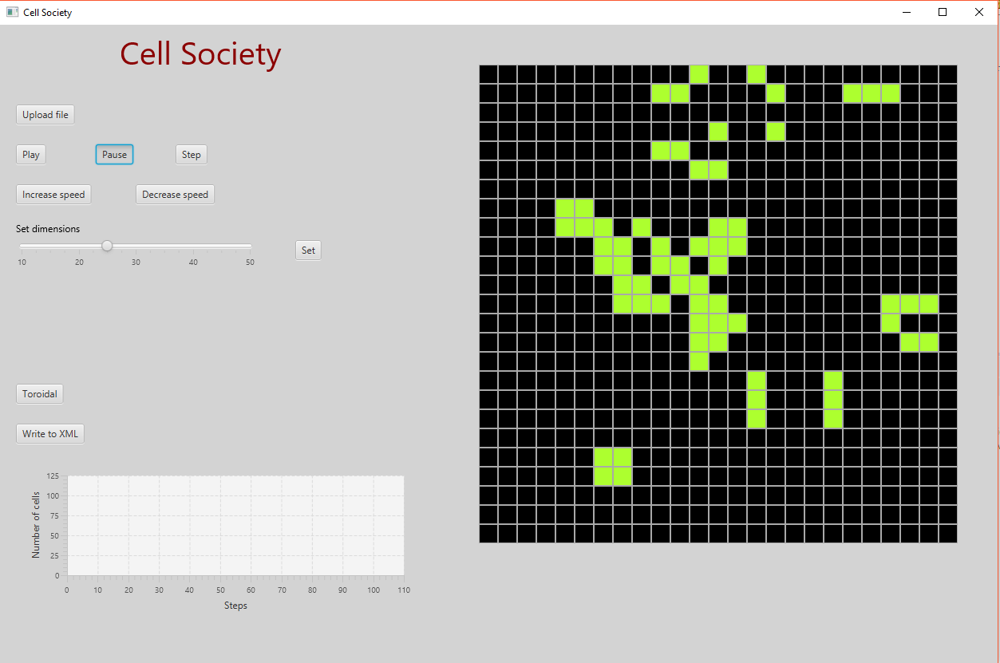

This is a cellular automata simulator created by Edward Zhuang, Julia Long, and Jeffrey Li.

This simulator supports Conway's Game of Life, forest fire spreading, predator-prey modeling, rock-paper-scissors, and segregation modeling. Both square and hexagonal cells may be used. 

# 

# 

# 

# 

# 

In order to run, the simulator needs to be supplied with a XML file with the following format:
```xml
<simulation type>
	<authors>
		<name></name>
	</authors>
	<dimensions>
		<xsize></xsize>
		<ysize></ysize>
	</dimensions>
	<parameter_list>
		<parameters>
			<value></value>
		</parameters>
	</parameter_list>
	<cell_on_list>
		<type>
	<cell></cell>
</type>	
<cell_on_list>
<simulation type>
```


Additionally, the program contains a resource file that can change the language used in the program to German.


